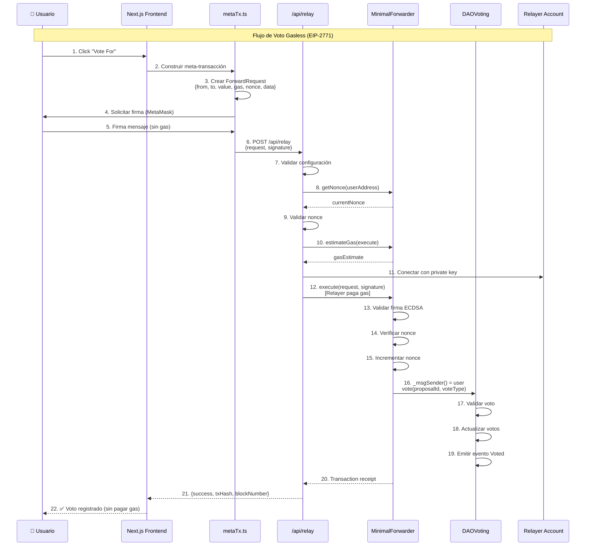
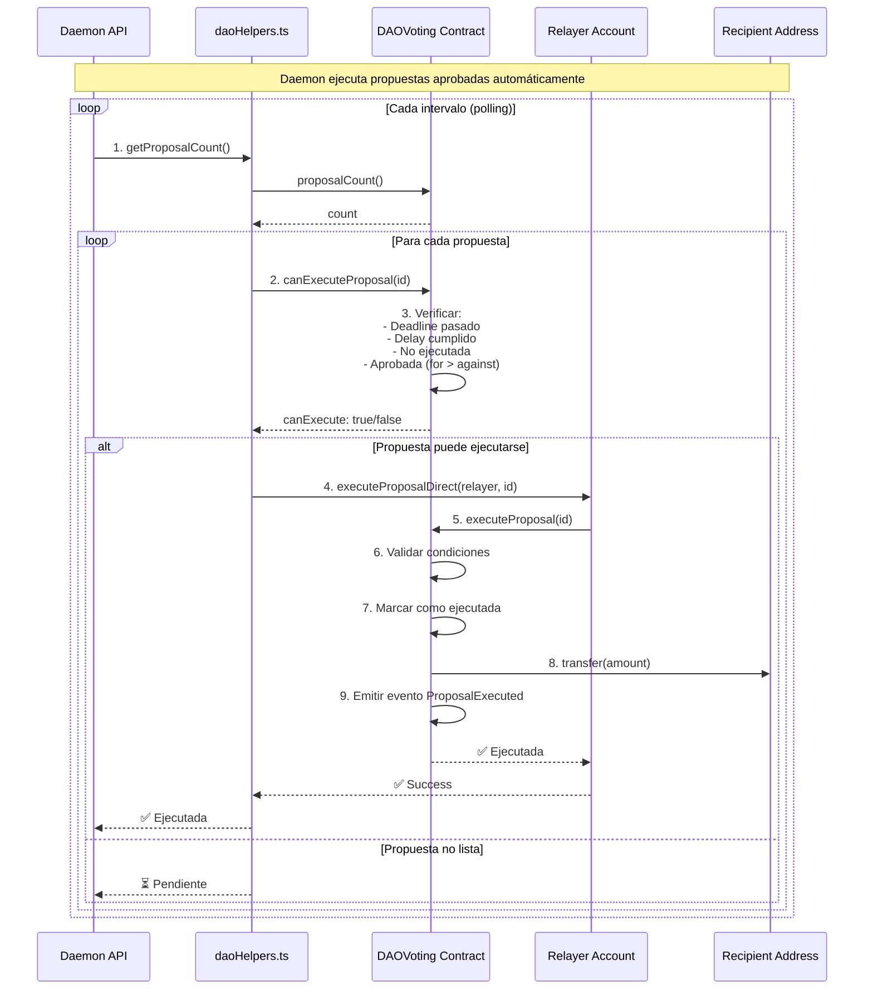

# 🏗️ Arquitectura del Sistema DAO

## 📊 Diagrama de Arquitectura del Sistema

Este diagrama muestra la arquitectura completa del sistema DAO, incluyendo los componentes frontend, backend, smart contracts y el flujo de meta-transacciones.

```mermaid
graph TB
    subgraph Users["👥 USUARIOS"]
        User[👤 Usuario<br/>MetaMask Wallet<br/>- Conecta wallet<br/>- Deposita ETH<br/>- Crea propuestas<br/>- Vota (gasless)]
    end

    subgraph Frontend["🌐 Frontend - Next.js (Puerto 3000)"]
        subgraph Pages["📄 Páginas"]
            MainPage[Página Principal<br/>- DAO Stats<br/>- Proposal List<br/>- Create Proposal<br/>- Wallet Connect]
        end
        
        subgraph Components["🧩 Componentes React"]
            WalletConnect[WalletConnect<br/>- Conecta MetaMask<br/>- Muestra balance]
            DAOStats[DAOStats<br/>- Treasury Balance<br/>- Proposal Count<br/>- User Balance]
            ProposalList[ProposalList<br/>- Lista propuestas<br/>- Estado: Active/Executed<br/>- Botones de voto]
            CreateProposal[CreateProposal<br/>- Formulario creación<br/>- Validación 10% balance]
        end
        
        subgraph ClientLib["📚 Librerías Cliente"]
            Web3Lib[web3.ts<br/>- Provider setup<br/>- Contract instances]
            MetaTxLib[metaTx.ts<br/>- Firma meta-transacciones<br/>- Construcción requests]
            ContractsLib[contracts.ts<br/>- ABIs<br/>- Addresses]
        end
    end

    subgraph Backend["⚙️ Backend - Next.js API Routes"]
        subgraph API["🔌 API Endpoints"]
            RelayAPI[POST /api/relay<br/>Meta-Transaction Relayer<br/>- Valida firma<br/>- Ejecuta en blockchain<br/>- Paga gas fees]
            DaemonAPI[GET /api/daemon<br/>Proposal Execution Daemon<br/>- Monitorea propuestas<br/>- Ejecuta aprobadas<br/>- Delay: 1 día]
        end
        
        subgraph ServerLib["📚 Librerías Servidor"]
            DAOHelpers[daoHelpers.ts<br/>- getProposalCount<br/>- canExecuteProposal<br/>- executeProposalDirect]
            DaemonLib[daemon.ts<br/>- Lógica daemon<br/>- Polling interval]
        end
    end

    subgraph Blockchain["⛓️ Blockchain - Anvil (Puerto 8545)"]
        subgraph Contracts["📝 Smart Contracts"]
            DAO[DAOVoting.sol<br/>- ERC2771Context<br/>- Proposal management<br/>- Voting system<br/>- Auto-execution<br/>- Treasury management]
            Forwarder[MinimalForwarder.sol<br/>- EIP-2771 Forwarder<br/>- Valida meta-tx<br/>- Nonce tracking<br/>- Replay protection]
        end
    end

    subgraph Infrastructure["🔧 Infraestructura"]
        Anvil[Anvil<br/>Local Ethereum Node<br/>Chain ID: 31337<br/>RPC: http://127.0.0.1:8545]
        Relayer[Relayer Account<br/>Private Key: RELAYER_PRIVATE_KEY<br/>- Paga gas fees<br/>- Ejecuta meta-tx]
    end

    %% Flujo de usuario
    User -->|1. Conecta wallet| WalletConnect
    WalletConnect -->|2. Lee datos| DAO
    User -->|3. Deposita ETH| DAO
    DAO -->|4. Actualiza balance| DAOStats
    
    %% Flujo de creación de propuesta
    User -->|5. Crea propuesta| CreateProposal
    CreateProposal -->|6. Valida 10% balance| DAO
    CreateProposal -->|7. Firma meta-tx| MetaTxLib
    MetaTxLib -->|8. POST /api/relay| RelayAPI
    RelayAPI -->|9. Valida firma| Forwarder
    Forwarder -->|10. Ejecuta| DAO
    DAO -->|11. Emite evento| ProposalList
    
    %% Flujo de voto (gasless)
    User -->|12. Vota| ProposalList
    ProposalList -->|13. Firma meta-tx| MetaTxLib
    MetaTxLib -->|14. POST /api/relay| RelayAPI
    RelayAPI -->|15. Ejecuta voto| DAO
    DAO -->|16. Actualiza estadísticas| ProposalList
    
    %% Flujo de daemon
    DaemonAPI -->|17. Monitorea| DAOHelpers
    DAOHelpers -->|18. Consulta estado| DAO
    DAOHelpers -->|19. Ejecuta si aprobada| DAO
    DAO -->|20. Transfiere fondos| Recipient
    
    %% Conexiones de infraestructura
    RelayAPI -->|Usa| Relayer
    DaemonAPI -->|Usa| Relayer
    Relayer -->|Conecta| Anvil
    DAO -->|Desplegado en| Anvil
    Forwarder -->|Desplegado en| Anvil
    
    %% Conexiones de librerías
    Web3Lib -->|Lee| DAO
    Web3Lib -->|Lee| Forwarder
    ContractsLib -->|Provee ABIs| Web3Lib
    ContractsLib -->|Provee ABIs| MetaTxLib

    %% Styling
    classDef user fill:#e3f2fd,stroke:#1976d2,stroke-width:2px
    classDef frontend fill:#f3e5f5,stroke:#7b1fa2,stroke-width:2px
    classDef backend fill:#fff3e0,stroke:#f57c00,stroke-width:2px
    classDef blockchain fill:#e8f5e9,stroke:#388e3c,stroke-width:2px
    classDef infra fill:#fce4ec,stroke:#c2185b,stroke-width:2px

    class User user
    class MainPage,WalletConnect,DAOStats,ProposalList,CreateProposal,Web3Lib,MetaTxLib,ContractsLib frontend
    class RelayAPI,DaemonAPI,DAOHelpers,DaemonLib backend
    class DAO,Forwarder blockchain
    class Anvil,Relayer infra
```

### 🔄 Flujo de Meta-Transacción (Gasless Voting)



### 🔄 Flujo de Ejecución Automática de Propuestas



## 🛠️ Diagrama de Tecnologías Usadas

Este diagrama muestra el stack tecnológico completo del proyecto DAO.

```mermaid
graph TB
    subgraph FrontendStack["🌐 Frontend Stack"]
        subgraph Framework["Framework"]
            NextJS[Next.js 15.5.9<br/>- App Router<br/>- Server Components<br/>- API Routes<br/>- Turbopack]
        end
        
        subgraph UI["UI & Styling"]
            React[React 19.1.0<br/>- Hooks<br/>- Components<br/>- State Management]
            TailwindCSS[Tailwind CSS 4<br/>- Utility-first CSS<br/>- Dark mode<br/>- Responsive]
        end
        
        subgraph Web3Frontend["Web3 Frontend"]
            EthersJS[Ethers.js 6.15.0<br/>- Provider<br/>- Contract interaction<br/>- MetaMask integration]
            MetaMask[MetaMask<br/>- Wallet connection<br/>- Transaction signing<br/>- Network switching]
        end
    end

    subgraph BackendStack["⚙️ Backend Stack"]
        subgraph APIServer["API Server"]
            NextAPI[Next.js API Routes<br/>- /api/relay<br/>- /api/daemon<br/>- Server-side logic]
        end
        
        subgraph Web3Backend["Web3 Backend"]
            EthersServer[Ethers.js Server<br/>- Relayer wallet<br/>- Transaction execution<br/>- Gas payment]
        end
    end

    subgraph BlockchainStack["⛓️ Blockchain Stack"]
        subgraph Development["Development"]
            Anvil[Anvil<br/>- Local Ethereum node<br/>- Chain ID: 31337<br/>- Fast development]
        end
        
        subgraph SmartContracts["Smart Contracts"]
            Solidity[Solidity 0.8.13<br/>- Smart contract language<br/>- ERC2771Context<br/>- EIP-2771 support]
            Foundry[Foundry<br/>- Forge compiler<br/>- Cast CLI<br/>- Anvil node<br/>- Test framework]
        end
        
        subgraph Libraries["Libraries"]
            OpenZeppelin[OpenZeppelin Contracts<br/>- ERC2771Context<br/>- Security patterns<br/>- Best practices]
            ForgeStd[Forge Std<br/>- Testing utilities<br/>- Script helpers<br/>- Cheatcodes]
        end
    end

    subgraph Standards["📋 Estándares & Protocolos"]
        EIP2771[EIP-2771<br/>Meta-Transactions<br/>- Gasless transactions<br/>- Trusted forwarder<br/>- Signature validation]
        ERC2771[ERC2771Context<br/>- Context extension<br/>- _msgSender() override<br/>- Forwarder integration]
    end

    subgraph Tools["🔧 Herramientas de Desarrollo"]
        TypeScript[TypeScript 5<br/>- Type safety<br/>- IntelliSense<br/>- Compile-time checks]
        ESLint[ESLint 9<br/>- Code quality<br/>- Next.js config<br/>- Best practices]
        Git[Git<br/>- Version control<br/>- Deployment scripts]
    end

    subgraph Infrastructure["🏗️ Infraestructura"]
        NodeJS[Node.js 18+<br/>- Runtime environment<br/>- Package management]
        NPM[NPM<br/>- Dependency management<br/>- Scripts execution]
    end

    %% Conexiones Frontend
    NextJS --> React
    NextJS --> TailwindCSS
    NextJS --> NextAPI
    React --> EthersJS
    EthersJS --> MetaMask
    
    %% Conexiones Backend
    NextAPI --> EthersServer
    EthersServer --> Anvil
    
    %% Conexiones Blockchain
    Solidity --> Foundry
    Foundry --> Anvil
    Solidity --> OpenZeppelin
    Foundry --> ForgeStd
    
    %% Conexiones Estándares
    Solidity --> ERC2771
    ERC2771 --> EIP2771
    EthersJS --> EIP2771
    
    %% Conexiones Tools
    NextJS --> TypeScript
    NextJS --> ESLint
    TypeScript --> NodeJS
    NodeJS --> NPM
    
    %% Styling
    classDef frontend fill:#e3f2fd,stroke:#1976d2,stroke-width:2px
    classDef backend fill:#fff3e0,stroke:#f57c00,stroke-width:2px
    classDef blockchain fill:#e8f5e9,stroke:#388e3c,stroke-width:2px
    classDef standards fill:#f3e5f5,stroke:#7b1fa2,stroke-width:2px
    classDef tools fill:#fce4ec,stroke:#c2185b,stroke-width:2px
    classDef infra fill:#e1f5ff,stroke:#01579b,stroke-width:2px

    class NextJS,React,TailwindCSS,EthersJS,MetaMask frontend
    class NextAPI,EthersServer backend
    class Anvil,Solidity,Foundry,OpenZeppelin,ForgeStd blockchain
    class EIP2771,ERC2771 standards
    class TypeScript,ESLint,Git tools
    class NodeJS,NPM infra
```

### 📦 Stack Tecnológico Detallado

#### Frontend
- **Next.js 15.5.9**: Framework React con App Router, Server Components y API Routes
- **React 19.1.0**: Biblioteca UI con hooks y componentes
- **Tailwind CSS 4**: Framework CSS utility-first
- **Ethers.js 6.15.0**: Biblioteca para interactuar con Ethereum
- **TypeScript 5**: Superset de JavaScript con tipado estático

#### Backend
- **Next.js API Routes**: Endpoints server-side para relayer y daemon
- **Ethers.js Server**: Ejecución de transacciones desde el servidor
- **Node.js 18+**: Runtime de JavaScript

#### Blockchain
- **Solidity 0.8.13**: Lenguaje de smart contracts
- **Foundry**: Suite de herramientas (Forge, Cast, Anvil)
- **Anvil**: Nodo Ethereum local para desarrollo
- **OpenZeppelin Contracts**: Librería de contratos seguros

#### Estándares
- **EIP-2771**: Estándar para meta-transacciones (gasless)
- **ERC2771Context**: Contexto extendido para soportar meta-transacciones

#### Herramientas
- **ESLint 9**: Linter para calidad de código
- **Git**: Control de versiones
- **NPM**: Gestor de paquetes

### 🔑 Características Clave

1. **Gasless Transactions**: Los usuarios votan sin pagar gas gracias a EIP-2771
2. **Meta-Transactions**: Firma off-chain, ejecución on-chain por relayer
3. **Auto-Execution**: Daemon ejecuta automáticamente propuestas aprobadas
4. **ERC2771Context**: Integración nativa con meta-transacciones
5. **Type Safety**: TypeScript en todo el stack
6. **Modern Stack**: Next.js 15, React 19, Tailwind 4
