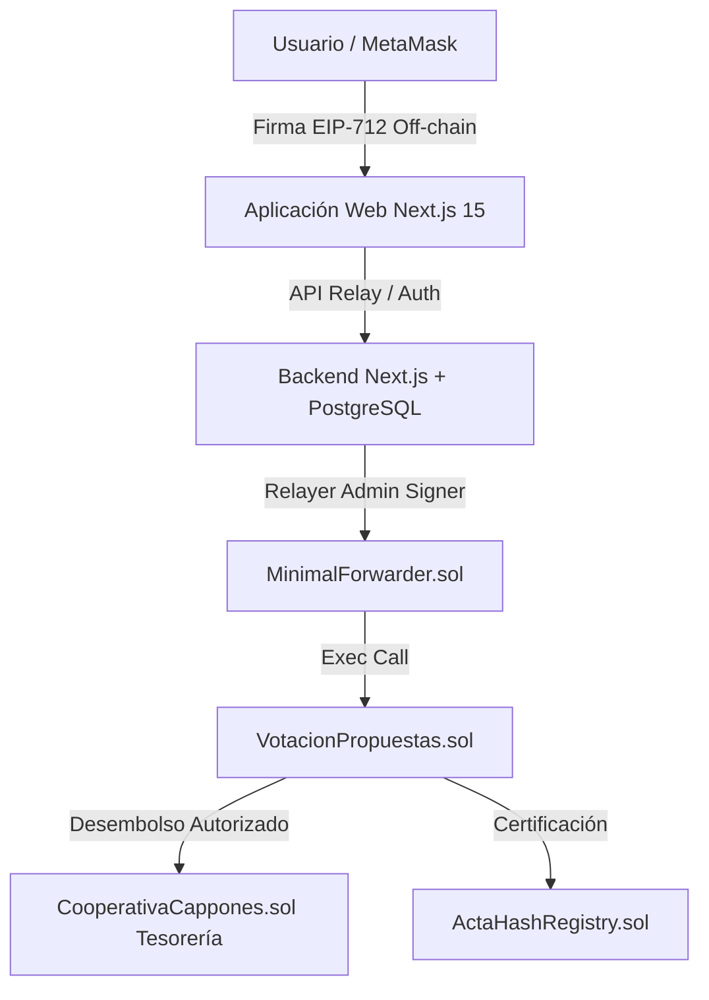

# 🏛️ DAO Los Cappones — Plataforma de Gobernanza y Tesorería Web3

Bienvenido al repositorio oficial de **DAO Los Cappones**, una plataforma integral de gobernanza descentralizada, gestión de tesorería y certificación inmutable de actas diseñada para la **Cooperativa de Ahorro y Préstamo Los Cappones**.

---

## 🚀 Descripción de la Plataforma

La plataforma permite a los socios y a la Junta Directiva de la cooperativa gestionar de manera transparente y segura el capital común, proponer proyectos de inversión, emitir votos **sin pagar comisiones de gas (Votación Gasless EIP-2771)** y certificar las decisiones mediante actas con hashes SHA-256 inmutables registrados en la blockchain.

### ✨ Funcionalidades Principales
- 🏦 **Tesorería y Aportes en Blockchain**: Custodia descentralizada de fondos en smart contracts con desembolsos automáticos al aprobarse propuestas de inversión.
- 🗳️ **Votación Gasless (EIP-2771 / Meta-Transactions)**: Los socios firman sus votos off-chain de forma gratuita mediante MetaMask y un servicio Relayer asume la transacción en la blockchain.
- 🔐 **Seguridad Multi-factor y Firmas Criptográficas**: Verificación estricta de identidad con `ethers.verifyMessage` y segundo factor de autenticación (2FA TOTP) para acciones directivas.
- 📜 **Registro Inmutable de Actas**: Certificación de documentos y resoluciones mediante hashes SHA-256 almacenados en el contrato `ActaHashRegistry.sol`.
- 👑 **Gobernanza Directiva y SuperUsuario**: Gestión del directorio (Presidente, Vicepresidente, Secretaria, Contralor y Contador) con el perfil inicial asignado al SuperUsuario **anlu**.

---

## 🏗️ Arquitectura del Sistema

La solución está construida sobre un stack moderno y reproducible:



- **Smart Contracts (Solidity ^0.8.20 & Foundry)**: `CooperativaCappones.sol`, `VotacionPropuestas.sol`, `MinimalForwarder.sol` y `ActaHashRegistry.sol`.
- **Backend (Next.js 15 & Prisma ORM)**: API RESTful protegida con autenticación criptográfica y base de datos PostgreSQL.
- **Frontend (Next.js 15 & React)**: Interfaz de usuario interactiva con Dashboard por pestañas (*Inicio*, *Propuestas*, *Directorio*, *Actas*).
- **Contenedores (Docker Compose & Anvil)**: Entorno local reproducibilidad de 3 contenedores (`postgres`, `anvil` y `web` compilado en producción).

---

## 👤 Identidad del SuperUsuario (`anlu`)

La plataforma cuenta con la configuración inicial del SuperUsuario administrativo:

| Parámetro | Valor Registrado |
|---|---|
| **Nombre** | `anlu` |
| **Cédula / Identificación** | `V-12533620` |
| **Correo Electrónico** | `anlucorporations@gmail.com` |
| **Cargo** | Owner de Contratos & Presidenta de la Cooperativa |
| **Wallet (Anvil Account #9)** | `0xa0Ee7A142d267C1f36714E4a8F75612F20a79720` |
| **Private Key (Metamask local)** | `0x2a871d0798f97d796df285775602922437370edd16347100108392d40b03220a` |
| **Credenciales PostgreSQL** | Usuario: `anlucorporations` / Pass: `KeLuDa.2324` |

---

## ⚡ Guía de Inicio Rápido (Despliegue Local con Docker)

El proyecto incluye automatización mediante **Makefile** para compilar y levantar todo el ecosistema con un solo comando.

### Requisitos Previos
- Docker y Docker Desktop instalados y corriendo.
- Node.js v20+ y Git.

### 1. Iniciar la Plataforma
```bash
make local-up
```
*Este comando compilará la app web en producción, iniciará el nodo Anvil, desplegará los smart contracts y sembrará la base de datos PostgreSQL con los directivos.*

### 2. Acceder a los Servicios
- 🌐 **Aplicación Web**: [http://localhost:3000](http://localhost:3000)
- ⛓️ **RPC Blockchain (Anvil)**: `http://localhost:8545` (Chain ID `31337`)
- 🗄️ **PostgreSQL**: `localhost:5432` (`cooperativa_cappones`)

### 3. Detener los Servicios
```bash
make local-down
```

---

## 🧪 Pruebas y Verificación

### Smart Contracts (Foundry)
```bash
cd contracts
forge test
```
*Supera el 100% de los 61 tests unitarios.*

### Chequeo de Tipos TypeScript (Frontend)
```bash
cd web
npm run typecheck
```
*Compilación limpia con 0 errores.*

---

## 📚 Documentación Adicional

- 📋 [COMPARATIVA_REQUERIMIENTOS_TAREA.md](file:///c:/Users/lucci/MasterCodeCripto/GitLab/dao/COMPARATIVA_REQUERIMIENTOS_TAREA.md): Matriz de cumplimiento punto por punto contra las especificaciones del proyecto.
- 🗺️ [ROADMAP_COMPLETAR_PLATAFORMA.md](file:///c:/Users/lucci/MasterCodeCripto/GitLab/dao/ROADMAP_COMPLETAR_PLATAFORMA.md): Auditoría técnica y plan de evolución.
- 📖 [docs/manuales/](file:///c:/Users/lucci/MasterCodeCripto/GitLab/dao/docs/manuales/): Manuales de usuario por rol (Socio, Presidente, Contralor, Contador).

---

## 🔗 Repositorio Oficial

- **GitLab Repository**: [https://gitlab.com/anlucorporations/dao](https://gitlab.com/anlucorporations/dao)
