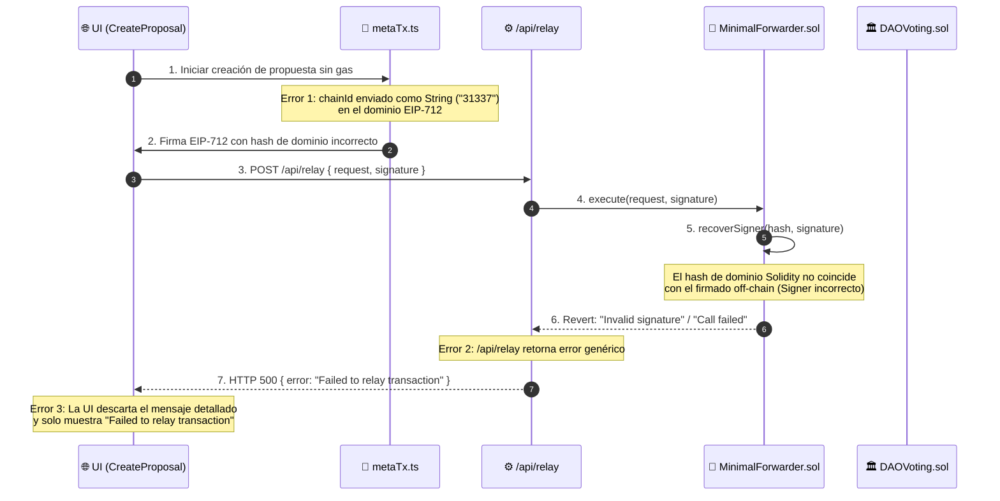
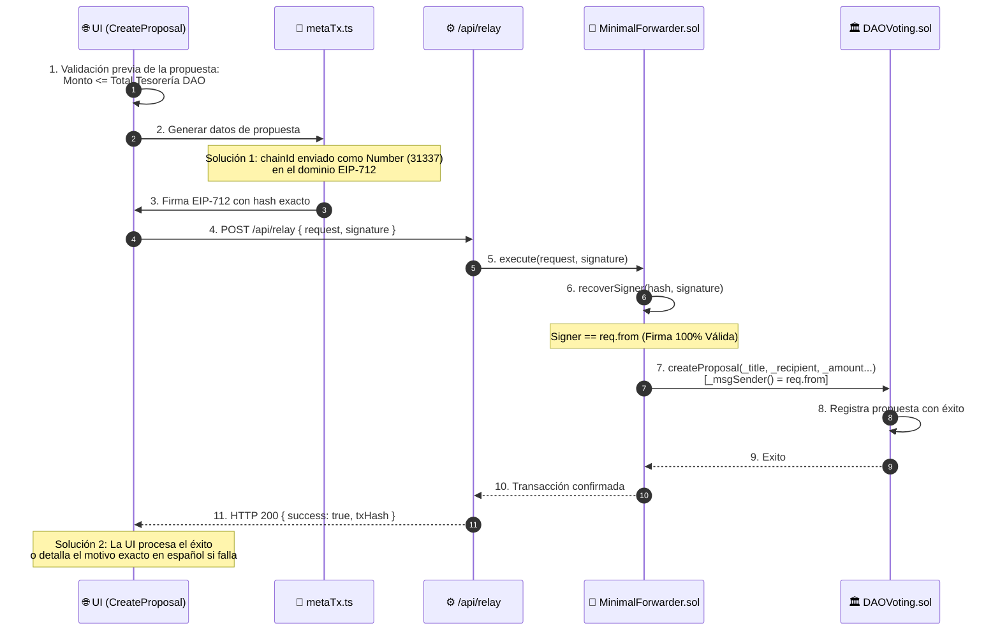

# Diagrama de Diagnóstico: Error y Solución en Transacciones Sin Gas (EIP-2771)

Este documento explica visualmente la causa del fallo **"Failed to relay transaction"** al crear propuestas sin gas y cómo fue corregido.

---

## ❌ 1. Diagrama del Error Detectado

---

## ✅ 2. Diagrama de la Solución Aplicada

---

## 📌 Resumen del Ajuste Técnico

| Componente | Causa del Problema | Solución Implementada |
| :--- | :--- | :--- |
| **`metaTx.ts`** | `domain.chainId` enviado como `String` en la firma EIP-712 | Convertido a `Number(chainId)` para coincidir exactamente con `block.chainid` en Solidity |
| **`CreateProposal.tsx`** | Intento de enviar propuestas con monto mayor al balance total | Agregada validación previa del saldo de la tesorería antes de firmar |
| **`/api/relay/route.ts`** | Retorno de error genérico sin detalles de la blockchain | Extracción y retorno del mensaje de revert original (`data.message`) |
