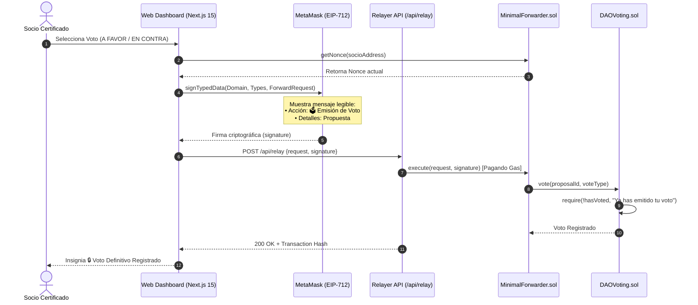
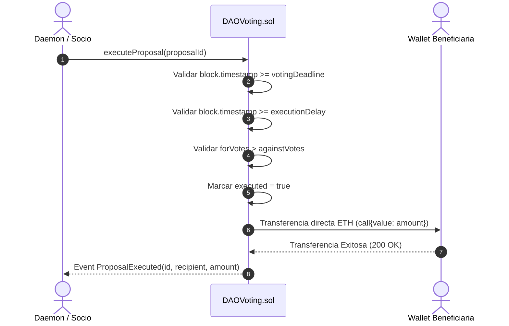

# 📐 Casos de Uso y Diagramas de Procesos — DAO Gasless EIP-2771

Este documento especifica los **Casos de Uso Formales** y visualiza los **Diagramas de Secuencia** para los flujos operativos fundamentales de la plataforma **DAO con Votación Gasless**.

---

## 1. Casos de Uso Formales

### CU-01: Autenticación y Conexión de Wallet
- **Actor:** Socio Certificado / Visitante.
- **Precondiciones:** Tener MetaMask instalado con la red Anvil (Local: 31337) o Testnet/Mainnet configurada.
- **Flujo Principal:**
  1. El usuario accede a la plataforma web (`http://localhost:3000` o Cloud Run).
  2. Presiona el botón **"Conectar Wallet"**.
  3. MetaMask solicita aprobación de conexión.
  4. El sistema verifica on-chain si la billetera está inscrita como socio activo (`isMember`).
  5. Si no está inscrita, el sistema restringe el acceso al Dashboard y redirige al usuario a la vista de inscripción (`/`).

### CU-02: Inscripción de Socio (Depósito de 3.0 ETH)
- **Actor:** Usuario No Inscrito.
- **Precondiciones:** Billetera conectada con al menos 3.0 ETH disponibles.
- **Flujo Principal:**
  1. El usuario visualiza el muro de membresía en el Dashboard.
  2. Presiona **"🛡️ Inscribirse como Socio (3.0 ETH)"**.
  3. MetaMask solicita confirmar la transacción enviando 3.0 ETH al contrato `DAOVoting.sol`.
  4. La transacción es minada on-chain (`registerMember()`).
  5. El usuario recibe la certificación de socio, su ponderación financiera y acceso completo al Dashboard de gobernanza.

### CU-03: Creación de Propuesta de Financiamiento
- **Actor:** Socio Certificado (≥10% del balance o socio activo).
- **Precondiciones:** Estar registrado como socio de la DAO.
- **Flujo Principal:**
  1. El socio navega a la sección **"Crear Propuesta"** (`/dashboard/proposals/create`).
  2. Completa los campos: Título, Beneficiario (Address), Monto en ETH, Duración de votación (días) y Descripción/Justificación.
  3. Elige la modalidad de envío: **⚡ Sin Gas (Meta-Transacción Relayer)** o **⛽ Directo (Pagando Gas)**.
  4. Si elige Sin Gas, MetaMask abre la ventana EIP-712 mostrando en texto claro: *Acción: 🛡️ Creación de Propuesta DAO* y los detalles financieros.
  5. La propuesta es registrada en el Smart Contract con un ID secuencial único (1, 2, 3...).

### CU-04: Votación Gasless EIP-712 (Mensaje Legible)
- **Actor:** Socio Certificado.
- **Precondiciones:** Estatus de socio activo y propuesta en periodo de votación activa.
- **Flujo Principal:**
  1. El socio ingresa a la sección **"Centro de Votación"** (`/dashboard/voting`).
  2. Selecciona la postura de voto: **👍 A FAVOR**, **👎 EN CONTRA** o **⚪ ABSTENCIÓN**.
  3. MetaMask despliega la ventana de firma EIP-712 con los campos legibles:
     - **Acción**: `🗳️ Emisión de Voto en Propuesta DAO`
     - **Detalles**: `Propuesta ID: #X | Decisión: 👍 A FAVOR | Modalidad: ⚡ Meta-Transacción Sin Gas`
  4. El socio firma el mensaje off-chain sin pagar gas.
  5. El frontend envía la firma a `/api/relay`.
  6. El Relayer verifica el nonce, ejecuta `MinimalForwarder.execute()` y registra el voto en la blockchain.
  7. La interfaz se inhabilita mostrando el distintivo `🔒 Voto Definitivo Registrado`.

### CU-05: Regla de Voto Único Inmutable
- **Actor:** Socio Certificado.
- **Precondiciones:** Haber emitido un voto previo en la propuesta actual.
- **Flujo Principal:**
  1. El socio intenta emitir un voto secundario en la misma propuesta.
  2. El Smart Contract revierte la ejecución con `require(!hasVoted, "Ya has emitido tu voto para esta propuesta")`.
  3. La interfaz captura la restricción y confirma la certificación del voto previamente emitido.

### CU-06: Ejecución Automática de Propuestas y Desembolso
- **Actor:** Daemon de Ejecución / Cualquier Socio.
- **Precondiciones:** Fecha límite de votación expirada, retardo de ejecución cumplido y votos positivos > votos negativos.
- **Flujo Principal:**
  1. El proceso en segundo plano (Daemon de Ejecución `/api/daemon`) o un socio presiona **"🚀 Ejecutar Propuesta"**.
  2. `DAOVoting.sol` verifica la validez del quórum.
  3. El contrato marca `executed = true` y transfiere automáticamente los ETH de la tesorería al beneficiario (`recipient.call{value: amount}`).

---

## 2. Diagramas de Procesos (Mermaid)

### 2.1 Diagrama de Secuencia: Votación Gasless EIP-712 con Mensaje Legible

### 2.2 Diagrama de Secuencia: Ejecución y Desembolso de Tesorería

