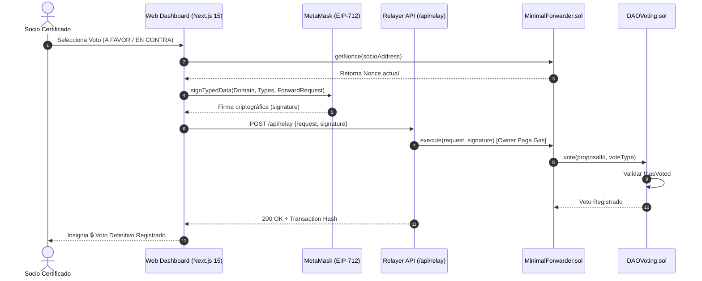
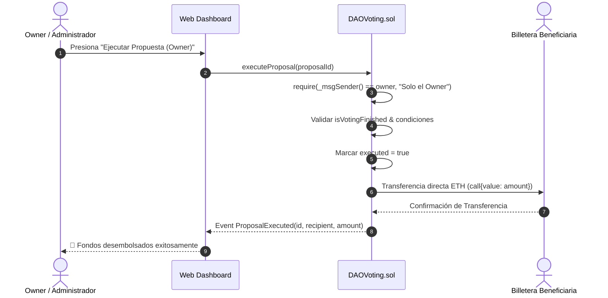

# 📐 Casos de Uso y Diagramas de Procesos — DAO Gasless EIP-2771

Este documento especifica los **Casos de Uso Formales** y los **Diagramas de Secuencia** para los flujos de gobernanza de la plataforma **DAO Gasless con EIP-2771**.

---

## 1. Casos de Uso Formales

### CU-01: Autenticación y Conexión de Wallet
- **Actor:** Socio Certificado / Visitante.
- **Precondiciones:** MetaMask instalado y configurado en la red RPC.
- **Flujo Principal:**
  1. El usuario accede a la plataforma web (`http://localhost:3000`).
  2. Presiona el botón **"Conectar Wallet"**.
  3. MetaMask aprueba la conexión.
  4. El sistema verifica on-chain si la billetera está inscrita como socio activo (`isMember`).
  5. Si no está inscrita, restringe el acceso al Dashboard y redirige al muro de membresía (`/`).

---

### CU-02: Inscripción de Socio (Depósito de 3.0 ETH)
- **Actor:** Usuario No Inscrito.
- **Precondiciones:** Billetera conectada con al menos 3.0 ETH disponibles.
- **Flujo Principal:**
  1. El usuario visualiza la pantalla de membresía.
  2. Presiona **"🛡️ Inscribirse como Socio (3.0 ETH)"**.
  3. Confirmación del depósito de 3.0 ETH en MetaMask dirigido a `DAOVoting.sol`.
  4. Ejecución del método `registerMember()`.
  5. El usuario obtiene certificación de socio y acceso completo al Dashboard.

---

### CU-03: Creación de Propuesta de Financiamiento
- **Actor:** Socio Certificado.
- **Precondiciones:** Billetera registrada como socio activo.
- **Flujo Principal:**
  1. El socio navega a la sección **"Crear Propuesta"** (`/dashboard/proposals/create`).
  2. Completa los campos: Título, Beneficiario (Address), Monto en ETH, Duración (días) y Memoria Justificativa.
  3. Elige la modalidad de envío: **⚡ Sin Gas (EIP-712 Relayer)** o **⛽ Directo**.
  4. Firma en MetaMask el mensaje legible EIP-712.
  5. El registro de la propuesta es procesado con un ID secuencial único.

---

### CU-04: Votación Gasless y Cierre Inmediato por Unanimidad (100%)
- **Actor:** Socio Certificado.
- **Precondiciones:** Propuesta en periodo de votación activa.
- **Flujo Principal:**
  1. El socio ingresa al **"Centro de Votación"** (`/dashboard/voting`).
  2. Selecciona su postura: **👍 A FAVOR**, **👎 EN CONTRA** o **⚪ ABSTENCIÓN**.
  3. Firma la autorización EIP-712 en MetaMask.
  4. El Relayer transmite la firma al contrato inteligente.
  5. **Evaluación de Unanimidad del 100%**: Si el 100% de los socios registrados aprueban la propuesta (`forVotes == memberCount`), la votación se da por **concluida inmediatamente** sin esperar el vencimiento del plazo.

---

### CU-05: Ejecución Manual Exclusiva del Owner y Desembolso
- **Actor:** Owner / Administrador de la DAO (`0xf39Fd6e51aad88F6F4ce6aB8827279cffFb92266`).
- **Precondiciones:** Propuesta aprobada (por unanimidad o por mayoría simple transcurrido el plazo y el retardo).
- **Flujo Principal:**
  1. El Owner conecta su billetera autorizada en la plataforma.
  2. En el Histórico o Modal de la propuesta aprobada, presiona **"🚀 Ejecutar Propuesta y Desembolsar ETH (Acción de Owner)"**.
  3. `DAOVoting.sol` verifica la restricción `require(_msgSender() == owner)`.
  4. El contrato liquida la propuesta (`executed = true`) y transfiere los fondos en ETH de la tesorería al beneficiario (`recipient.call{value: amount}`).

---

### CU-06: Notificaciones de Gobernanza en Vivo
- **Actor:** Socio Certificado.
- **Precondiciones:** Billetera conectada a la plataforma.
- **Flujo Principal:**
  1. El socio visualiza el icono de la campana 🔔 en el encabezado.
  2. Si una votación concluye, se alcanza el 100% de unanimidad o se activa un 2º periodo (repechaje), se incrementa el contador de alertas no leídas.
  3. Al desplegar el menú, el socio puede revisar los detalles de cada evento y marcar notificaciones como leídas.

---

## 2. Diagramas de Procesos (Mermaid)

### 2.1 Diagrama de Secuencia: Votación Gasless EIP-712

### 2.2 Diagrama de Secuencia: Ejecución Manual Exclusiva del Owner

