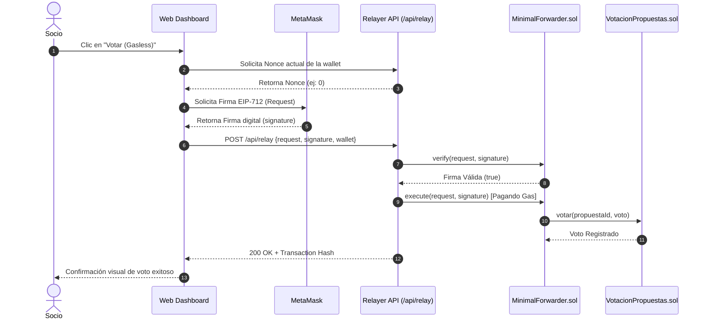
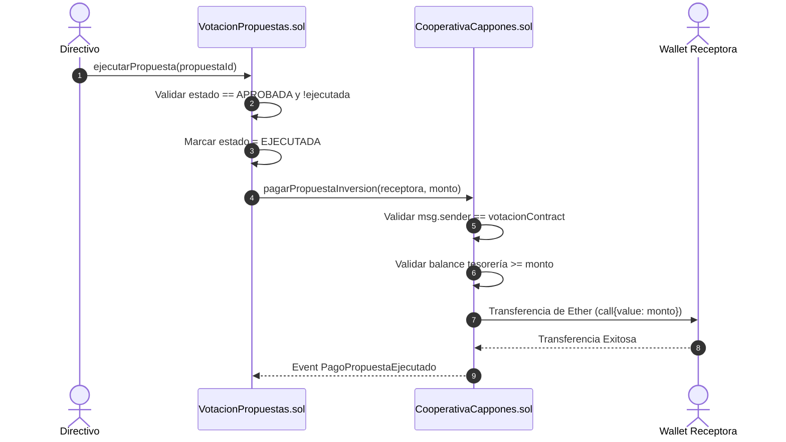

# 📐 Casos de Uso y Diagramas de Procesos — DAO Los Cappones

Este documento especifica los **Casos de Uso Formales** y visualiza los **Diagramas de Secuencia** para los flujos operativos fundamentales de la plataforma **DAO Los Cappones**.

---

## 1. Casos de Uso Formales

### CU-01: Autenticación y Conexión de Wallet
- **Actor:** Socio / Directivo / SuperUsuario.
- **Precondiciones:** Tener MetaMask instalado con la red Anvil/Amoy configurada.
- **Flujo Principal:**
  1. El usuario accede al Dashboard web ([http://localhost:3000](http://localhost:3000)).
  2. Presiona el botón **"Conectar MetaMask"**.
  3. MetaMask solicita la aprobación de conexión.
  4. El servidor valida la firma criptográfica del mensaje y retorna el rol del socio.

### CU-02: Creación de Propuesta con Validaciones y 2FA
- **Actor:** Presidente / Contralor / Contador (Junta Directiva).
- **Precondiciones:** Poseer rol directivo activo y código TOTP 2FA.
- **Flujo Principal:**
  1. El directivo ingresa a la pestaña *"Propuestas"*.
  2. Completa los campos: Nombre, Monto, Descripción, Wallet Receptora y Token 2FA.
  3. El sistema valida el 2FA en `/api/proposals` y registra la propuesta en blockchain y PostgreSQL.
  4. Se generan automáticamente los registros de avales pendientes para los demás directivos.

### CU-03: Votación Gasless EIP-2771
- **Actor:** Socio Cooperativista.
- **Precondiciones:** Estatus de socio activo y propuesta en estado `EN_VOTACION`.
- **Flujo Principal:**
  1. El socio selecciona la propuesta y presiona **"Votar (Gasless)"**.
  2. La app genera una firma off-chain EIP-712 que contiene la propuesta, elección y nonce.
  3. La firma se envía al endpoint `/api/relay`.
  4. El Relayer valida el nonce, ejecuta `MinimalForwarder.execute()` pagando el gas y guarda el hash del voto.

### CU-04: Ejecución y Desembolso de Tesorería
- **Actor:** Miembro del Directorio.
- **Precondiciones:** Propuesta aprobada por quórum y quórum de avales firmados.
- **Flujo Principal:**
  1. El directivo presiona **"Ejecutar Propuesta"**.
  2. `VotacionPropuestas.sol` cambia el estado a `EJECUTADA`.
  3. `VotacionPropuestas.sol` invoca a `CooperativaCappones.sol.pagarPropuestaInversion()`.
  4. La tesorería transfiere el monto exacto en Ether a la wallet receptora.

---

## 2. Diagramas de Procesos (Mermaid)

### 2.1 Diagrama de Secuencia: Votación Gasless EIP-2771

### 2.2 Diagrama de Secuencia: Desembolso de Tesorería Aprobado

