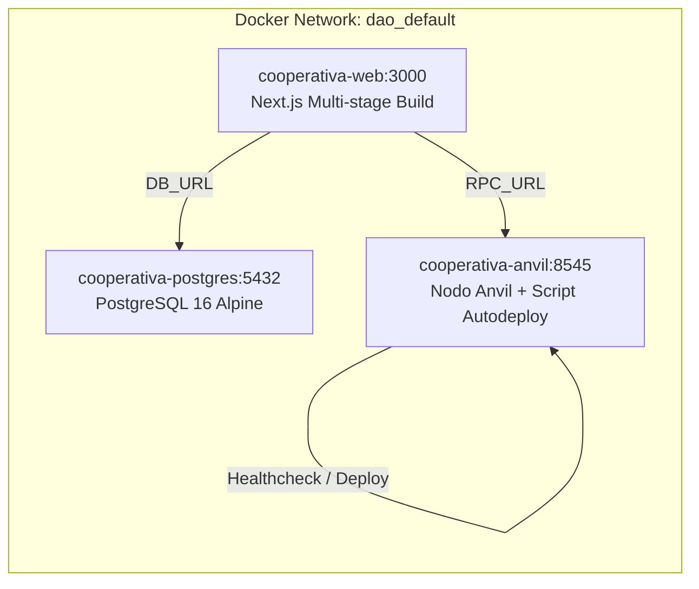

# 🐳 Manual de Despliegue Local con Docker — DAO Los Cappones

Este documento describe de manera exhaustiva el procedimiento para compilar, desplegar y administrar la infraestructura containerizada de la plataforma **DAO Los Cappones** utilizando **Docker Compose**.

---

## 1. Arquitectura del Stack de Contenedores

La plataforma opera localmente mediante 3 servicios interconectados a través de una red virtual privada de Docker (`dao_default`):



### Detalle de Contenedores

1. **`cooperativa-postgres`**:
   - **Imagen:** `postgres:16-alpine`
   - **Puerto Expuesto:** `5432:5432`
   - **Volumen Persistente:** `dao_postgres_data`
   - **Credenciales por Defecto:** Usuario `anlucorporations` / Pass `KeLuDa.2324` / Database `cooperativa_cappones`.
   - **Healthcheck:** `pg_isready -U anlucorporations -d cooperativa_cappones`.

2. **`cooperativa-anvil`**:
   - **Imagen:** `ghcr.io/foundry-rs/foundry`
   - **Puerto Expuesto:** `8545:8545`
   - **Script de Entrada:** [`contracts/docker-entrypoint.sh`](file:///c:/Users/lucci/MasterCodeCripto/GitLab/dao/contracts/docker-entrypoint.sh).
   - **Comportamiento:** Inicia el nodo Anvil local (Chain ID `31337`), espera la inicialización y ejecuta `forge script script/DeployLocal.s.sol` utilizando la clave privada del SuperUsuario `anlu` (#9), exportando las direcciones a `contracts/deployments/local.json`.

3. **`cooperativa-web`**:
   - **Dockerfile Multi-Stage:** [`web/Dockerfile`](file:///c:/Users/lucci/MasterCodeCripto/GitLab/dao/web/Dockerfile) (`builder` stage con `npm run build` -> `runner` stage con `next start`).
   - **Puerto Expuesto:** `3000:3000`
   - **Comportamiento:** Genera Prisma Client, ejecuta `npx prisma db push`, realiza el seed inicial y arranca el servidor web optimizado en producción.

---

## 2. Requisitos de Sistema

- **Sistema Operativo:** Windows 10/11 (con WSL2 / Docker Desktop), macOS o Linux.
- **RAM:** Mínimo 4 GB dedicados a Docker Engine.
- **Software:** Docker Engine v24+, Docker Compose v2+ y `make` (opcional).

---

## 3. Guía Paso a Paso de Despliegue

### Opción A: Mediante Makefile (Recomendado)

En la raíz del proyecto, ejecuta:

```bash
make local-up
```

### Opción B: Mediante Comandos Docker Directos

Si no cuentas con `make`, puedes ejecutar directamente:

```bash
docker compose up --build -d
```

---

## 4. Verificación y Monitoreo del Despliegue

### 4.1 Comprobar el Estado de los Contenedores
```bash
docker compose ps
```
*Salida esperada:*
```text
NAME                   IMAGE                STATUS                   PORTS
cooperativa-anvil      dao-anvil            Up (healthy)             0.0.0.0:8545->8545/tcp
cooperativa-postgres   postgres:16-alpine   Up (healthy)             0.0.0.0:5432->5432/tcp
cooperativa-web        dao-web              Up                       0.0.0.0:3000->3000/tcp
```

### 4.2 Inspeccionar Logs en Tiempo Real
Para ver la salida combinada de todos los servicios:
```bash
make local-logs
# O bien:
docker compose logs -f
```

Para ver el log específico del despliegue de contratos en Anvil:
```bash
docker logs cooperativa-anvil
```

---

## 5. Detener y Limpiar el Entorno Local

Para apagar los contenedores y remover volúmenes/redes temporales:

```bash
make local-down
# O bien:
docker compose down -v
```

---

## 6. Resolución de Problemas (Troubleshooting)

### Conflictos de Puertos (5432, 8545, 3000)
Si recibes un error `port is already allocated`:
1. Verifica qué servicio local está ocupando el puerto:
   - **Windows:** `netstat -ano | findstr :3000`
   - **Linux/macOS:** `lsof -i :3000`
2. Detén cualquier instancia local previa de PostgreSQL, Anvil o Next.js que se esté ejecutando fuera de Docker.

### Error de Conexión con PostgreSQL en la App Web
El contenedor `cooperativa-web` espera automáticamente a que `cooperativa-postgres` pase el *healthcheck*. Si la migración de Prisma falla por algún motivo:
```bash
docker compose restart web
```
