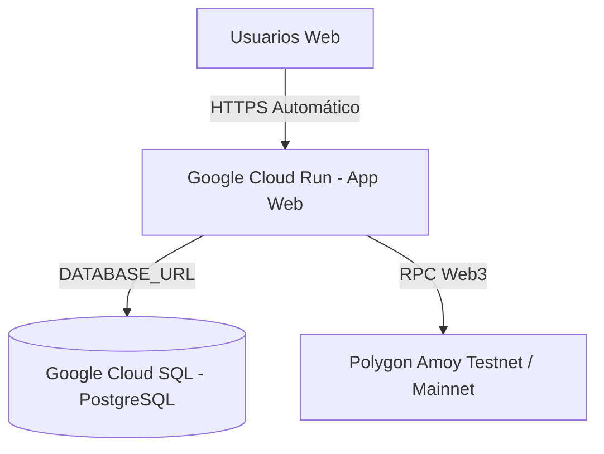

# ☁️ Manual de Despliegue en Google Cloud Platform (GCP) — DAO Los Cappones

Este manual proporciona las instrucciones detalladas para desplegar la plataforma **DAO Los Cappones** en **Google Cloud Platform (GCP)** utilizando dos arquitecturas principales:

1. **Opción 1: Compute Engine (GCE VM con Docker Compose)** — Despliegue rápido y completo con Anvil local, PostgreSQL y Web en una instancia de Google Cloud.
2. **Opción 2: Cloud Run + Cloud SQL (Arquitectura Serverless de Producción)** — Despliegue altamente escalable conectado a Polygon Amoy / Mainnet.

---

## 🏗️ Opción 1: Despliegue en Google Compute Engine (GCE VM)

Esta opción permite ejecutar la arquitectura multi-contenedor idéntica al entorno local mediante Docker Compose.

```mermaid
graph TD
    USER[Usuarios Web] -->|HTTP / Port 3000| GCE_IP[IP Estática Externa GCP]
    subgraph Google Compute Engine VM (Ubuntu 22.04 LTS)
        subgraph Docker Compose Stack
            WEB[cooperativa-web :3000]
            PG[cooperativa-postgres :5432]
            ANVIL[cooperativa-anvil :8545]
        end
    end
    GCE_IP --> WEB
    WEB --> PG
    WEB --> ANVIL
```

### Paso 1: Autenticación e Inicialización de gcloud CLI
Abre tu consola local y autentícate en tu cuenta de Google Cloud:

```bash
gcloud auth login
```

Selecciona o crea un proyecto en GCP:
```bash
gcloud config set project ID_DE_TU_PROYECTO_GCP
```

### Paso 2: Crear la Regla de Firewall en GCP
Permite el tráfico de red en los puertos `3000` (Web) y `8545` (Anvil RPC):

```bash
gcloud compute firewall-rules create allow-dao-ports \
    --allow tcp:3000,tcp:8545 \
    --target-tags=dao-server \
    --description="Permitir acceso web y RPC a la plataforma DAO"
```

### Paso 3: Crear la Instancia Compute Engine (VM)
Crea una máquina virtual Ubuntu de rendimiento estándar:

```bash
gcloud compute instances create dao-cappones-vm \
    --zone=us-central1-a \
    --machine-type=e2-standard-2 \
    --image-family=ubuntu-2204-lts \
    --image-project=ubuntu-os-cloud \
    --tags=dao-server \
    --boot-disk-size=30GB
```

### Paso 4: Configurar Docker y Desplegar el Proyecto en la VM
Conéctate a la VM por SSH:
```bash
gcloud compute ssh dao-cappones-vm --zone=us-central1-a
```

Una vez dentro de la VM, ejecuta la instalación de Docker y la clonación del repositorio:
```bash
# Actualizar e instalar Docker & Git
sudo apt-get update
sudo apt-get install -y docker.io docker-compose-v2 git make
sudo usermod -aG docker $USER
newgrp docker

# Clonar el repositorio oficial de GitLab
git clone https://gitlab.com/anlucorporations/dao.git
cd dao

# Levantar toda la plataforma en producción
make local-up
```

### Paso 5: Obtener la IP Pública y Acceder a la Plataforma
Obtén la IP externa asignada a tu máquina virtual:
```bash
gcloud compute instances describe dao-cappones-vm \
    --zone=us-central1-a \
    --format='get(networkInterfaces[0].accessConfigs[0].natIP)'
```

Ingresa en tu navegador web a: `http://TU_IP_EXTERNA:3000`

---

## 🚀 Opción 2: Despliegue en Google Cloud Run + Cloud SQL (Serverless Producción)

Para arquitecturas de producción conectadas a redes de prueba públicas (Polygon Amoy) o Mainnet:



### Paso 1: Habilitar los Servicios Necesarios en GCP
```bash
gcloud services enable run.googleapis.com \
                       sqladmin.googleapis.com \
                       artifactregistry.googleapis.com
```

### Paso 2: Crear el Registro de Imágenes en Artifact Registry
```bash
gcloud artifacts repositories create dao-repo \
    --repository-format=docker \
    --location=us-central1 \
    --description="Repositorio Docker para DAO Los Cappones"
```

### Paso 3: Compilar y Enviar la Imagen Docker a GCP
```bash
gcloud builds submit --tag us-central1-docker.pkg.dev/ID_DE_TU_PROYECTO_GCP/dao-repo/dao-web:latest ./web
```

### Paso 4: Desplegar el Servicio en Cloud Run
```bash
gcloud run deploy dao-web-service \
    --image=us-central1-docker.pkg.dev/ID_DE_TU_PROYECTO_GCP/dao-repo/dao-web:latest \
    --platform=managed \
    --region=us-central1 \
    --allow-unauthenticated \
    --port=3000 \
    --set-env-vars NEXT_PUBLIC_CHAIN_ID=80002,NEXT_PUBLIC_RPC_URL=https://rpc-amoy.polygon.technology
```

---

## 📋 Resumen de Opciones

| Criterio | Opción 1: Compute Engine VM | Opción 2: Cloud Run + Cloud SQL |
|---|---|---|
| **Complejidad** | ⭐ Muy Sencilla (1 comando `make local-up`) | ⭐⭐⭐ Media (Requiere Polygon Amoy) |
| **Tiempo de Despliegue** | 5 minutos | 15 minutos |
| **Nodo Blockchain** | Anvil local en la VM | Polygon Amoy / Red Pública |
| **Costo Estimado GCP** | ~$25 - $35 USD/mes | Configuración gratis / Pago por uso |
| **Dominio y SSL** | IP pública (requiere Nginx para SSL) | HTTPS automático en `.a.run.app` |
